# MidiControl

PyQt6-based custom Qt widgets for controlling MIDI instruments.

## Features

- Interactive envelope editors with draggable control points
- Custom curve rendering with gradient fill and grid overlay
- Real-time parameter display on hover and drag
- Transform-based coordinate system (Y-axis increases upward)
- All parameters clamped to MIDI range (0-127)

## Widgets

### QMCAmpADSR

Standard ADSR (Attack, Decay, Sustain, Release) amplifier envelope.

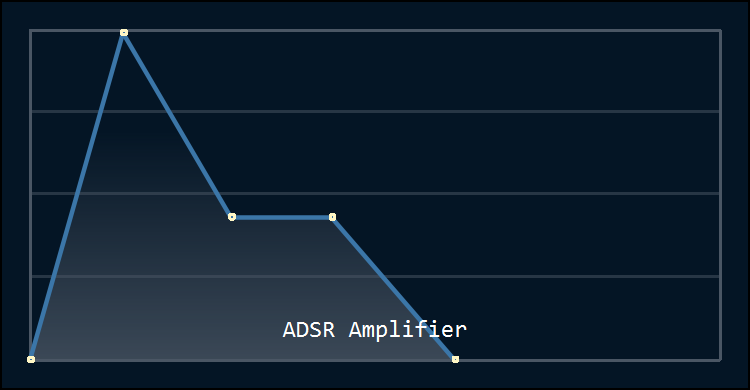

```python
adsr = QMCAmpADSR()
adsr.attack_time = 20
adsr.attack_level = 127
adsr.decay_time = 35
adsr.sustain_level = 80
adsr.release_time = 40
```

| Property       | Range   | Description                    |
|----------------|---------|--------------------------------|
| `attack_time`  | 0-127   | Attack duration                |
| `attack_level` | 0-127   | Peak level after attack        |
| `decay_time`   | 0-127   | Decay duration                 |
| `sustain_level` | 0-127  | Sustain amplitude level        |
| `release_time` | 0-127   | Release duration               |

#### Breakpoint mode

Extended envelope with a decay breakpoint, splitting decay into two stages.

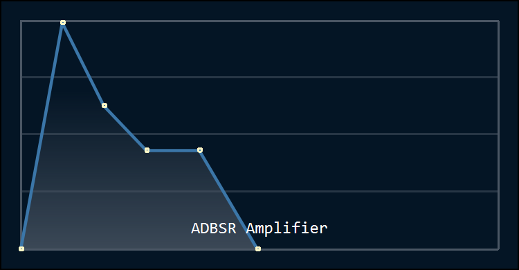

```python
adbsr = QMCAmpADSR(breakpoint=True)
adbsr.breakpoint_time = 25
adbsr.breakpoint_level = 100
```

| Property           | Range   | Description                            |
|--------------------|---------|----------------------------------------|
| `breakpoint_time`  | 0-127   | Decay1 duration (Attack to Breakpoint) |
| `breakpoint_level` | 0-127   | Amplitude level at breakpoint          |

---

### QMCSlider

Custom-painted vertical fader with configurable groove width and indicator line.

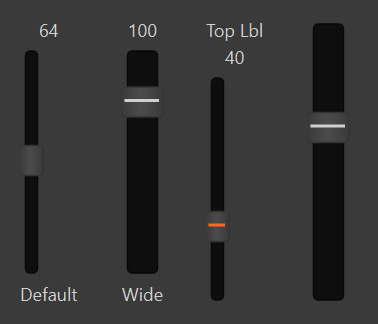

```python
QMCSlider(label="Volume", default=100)
QMCSlider(label="Wide", default=100, groove_width=20, indicator_color="#d0d0d0")
QMCSlider(label="Top", default=40, indicator_color="#ff6622",
          label_position='top', value_position='bottom')
QMCSlider(default=80, groove_width=20, show_label=False, show_value=False)
```

| Parameter         | Default    | Description                              |
|-------------------|------------|------------------------------------------|
| `label`           | `""`       | Label text                               |
| `min_val`         | `0`        | Minimum value                            |
| `max_val`         | `127`      | Maximum value                            |
| `default`         | `0`        | Initial value                            |
| `indicator_color` | `None`     | Colored line on the handle               |
| `groove_width`    | `8`        | Groove pixel width                       |
| `show_label`      | `True`     | Show/hide name label                     |
| `show_value`      | `True`     | Show/hide value display                  |
| `label_position`  | `'bottom'` | `'top'` or `'bottom'`                    |
| `value_position`  | `'top'`    | `'top'` or `'bottom'`                    |

---

### QMCSliderGroup

Groups sliders with tick marks between grooves and optional label rows.

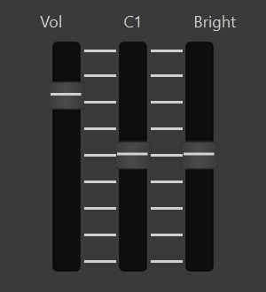
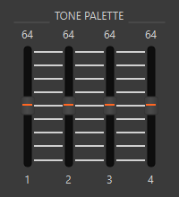

```python
grp = QMCSliderGroup(labels=["Vol", "C1", "Bright"], label_position='top',
                      ticks=True, compact=True, tick_color='#d0d0d0')
grp.addSlider(QMCSlider(default=100, groove_width=20))

grp2 = QMCSliderGroup(top_label="TONE PALETTE", ticks=True)
grp2.addSlider(QMCSlider(label="1", default=64, indicator_color="#ff6622"))
```

| Parameter        | Default    | Description                                  |
|------------------|------------|----------------------------------------------|
| `labels`         | `None`     | List of label strings (rendered in own row)   |
| `label_position` | `'top'`    | `'top'` or `'bottom'`                        |
| `top_label`      | `None`     | Title bar text (lines at bottom of spacers)   |
| `bottom_label`   | `None`     | Title bar text (lines at top of spacers)      |
| `ticks`          | `False`    | Draw tick marks between grooves               |
| `tick_count`     | `9`        | Number of ticks per gap                       |
| `tick_color`     | `'#d0d0d0'`| Tick color                                   |
| `compact`        | `False`    | Center sliders with expanding spacers         |

---

### QMCBendModWheel

2-axis joystick for horizontal Bender and vertical Modulation. Stick rests at bottom-center.

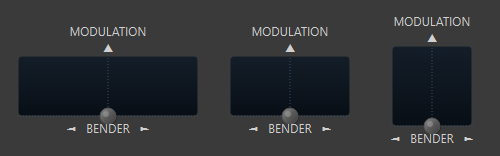

```python
bm = QMCBendModWheel(aspect_ratio=3, spring_back=True)
bm.bender       # -64 to +63
bm.modulation   #   0 to 127
```

| Parameter      | Default | Description                              |
|----------------|---------|------------------------------------------|
| `spring_back`  | `False` | Return to rest position on release       |
| `aspect_ratio` | `3`     | Pad width:height ratio (3, 2, or 1)     |

| Signal              | Type  | Description              |
|---------------------|-------|--------------------------|
| `benderChanged`     | `int` | Emitted on X-axis change |
| `modulationChanged` | `int` | Emitted on Y-axis change |

---

### QMCDial

Custom-painted rotary knob with standard and endless rotation modes.

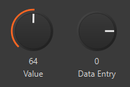

```python
dial = QMCDial(label="Value")
dial.value = 64

endless_dial = QMCDial(label="Data Entry", endless=True)
```

| Parameter  | Default | Description                            |
|------------|---------|----------------------------------------|
| `label`    | `""`    | Label text                             |
| `min_val`  | `0`     | Minimum value                          |
| `max_val`  | `127`   | Maximum value                          |
| `endless`  | `False` | Endless rotation (no min/max stops)    |

---

### QMCButton

Hardware-style thin button with label above and optional LED slit indicator.

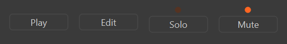
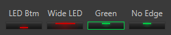

```python
QMCButton(text="Play")                                    # momentary
QMCButton(text="Solo", toggleable=True)                   # toggle with LED
QMCButton(text="Green", toggleable=True, led_color='#00cc44', led_off_color='#003300')
QMCButton(text="Frame", toggleable=True, edge_light=True)
```

| Parameter       | Default     | Description                           |
|-----------------|-------------|---------------------------------------|
| `text`          | `""`        | Label text (displayed above body)     |
| `toggleable`    | `False`     | Enable toggle mode                    |
| `led`           | `True`      | Show LED slit when toggleable         |
| `led_size`      | `0.2`       | LED width as fraction of body (0.1-1.0) |
| `led_position`  | `'top'`     | `'top'` or `'bottom'`                |
| `led_color`     | `'#cc0000'` | LED on color                          |
| `led_off_color` | `'#330000'` | LED off color                         |
| `edge_light`   | `False`     | Tint border with LED color            |

---

### QMCKeyboard

Dynamic piano keyboard with configurable note range. Scales to fill available space.

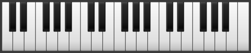

```python
keyboard = QMCKeyboard(start_note=28, end_note=103)  # 76 keys (E1-G7)
keyboard.noteOn.connect(lambda note, vel: ...)
keyboard.noteOff.connect(lambda note: ...)
keyboard.aftertouch.connect(lambda note, pressure: ...)
```

| Parameter          | Default | Description                          |
|--------------------|---------|--------------------------------------|
| `start_note`       | `28`    | First MIDI note number               |
| `end_note`         | `103`   | Last MIDI note number                |
| `aftertouch_pixels`| `64`    | Pixels of downward drag for full 127 |

| Signal       | Type        | Description                                    |
|--------------|-------------|------------------------------------------------|
| `noteOn`     | `int, int`  | Note number and velocity (from vertical click position) |
| `noteOff`    | `int`       | Note number on key release                     |
| `aftertouch` | `int, int`  | Note number and pressure (0-127) from drag down |

---

### QMCGroup

Section container with a styled header strip and gradient content background.

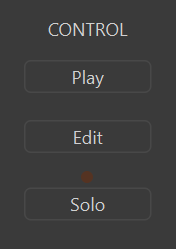

```python
grp = QMCGroup(title="CONTROL")
grp.addWidget(button)
grp.setContentLayout(grid_layout)
```

## Setup

```bash
python -m venv .venv
.venv/Scripts/activate && pip install -r requirements.txt
```

## Run

```bash
.venv/Scripts/activate && python midiWidgets.py
```
