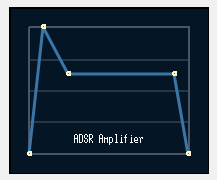

# MidiControl

PyQt6 widgets for controlling MIDI instruments.

## QMCAmpADSR

Interactive ADSR envelope editor with draggable control points and custom curve rendering.



## Setup

```bash
python -m venv .venv
.venv/Scripts/activate && pip install -r requirements.txt
```

## Run

```bash
.venv/Scripts/activate && python midiWidgets.py
```
